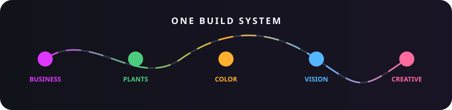
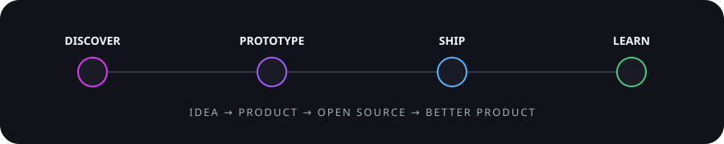

# George Lazaridis

**Founder of [Coded Letter](https://codedletter.com) · Product engineer · Creative technologist**

I build open commerce systems, useful experiments, and software with a point of view.

## Areas of work

<table>
<tr>
<td width="50%" valign="top">

###  Business & commerce

At **[Coded Letter](https://codedletter.com)** I design and build products,
integrations, and dependable commerce systems.

- **[Superfunky](https://superfunky.pro)** — open-core headless commerce
- **[Storefront](https://github.com/coded-letter/superfunky-storefront)** — React + TypeScript
- **[WordPress theme](https://github.com/coded-letter/superfunky-theme)** — Gutenberg + GraphQL
- **[Woo Google Sheets](https://github.com/coded-letter/woo-google-sheets)** — operations automation

</td>
<td width="50%" valign="top">

###  Plants & connected things

Software and hardware for understanding and caring for plants.

- **[Plant Guardian](https://plantguardian.app)** — private product web app
- **[Plant Growth Tracker](https://github.com/Ys-sudo/plant-growth-tracker)** — camera-based growth tracking
- **Plantstation** — private sensor and automation R&D

</td>
</tr>
<tr>
<td width="50%" valign="top">

###  Color systems

Product R&D around palettes, conversion, visual discovery, and color data.

- **[Colors Science](https://colors.science)** — color knowledge and exploration
- **[Colorbase Cloud](https://colorbase.cloud)** — next-generation color platform
- Shared focus: useful color tools with strong visual UX

</td>
<td width="50%" valign="top">

###  Computer vision

Practical browser experiments that turn cameras and images into interfaces.

- **[Hair Coloring App](https://ys-sudo.github.io/hair-coloring-app/)** — live MediaPipe segmentation
- **[Source](https://github.com/Ys-sudo/hair-coloring-app)** — MIT, private-by-design processing
- **[AR Face Mask](https://github.com/Ys-sudo/mediapipe-ar-facemask)** — landmarks and segmentation

</td>
</tr>
<tr>
<td colspan="2" valign="top">

###  Creative coding

Interactive graphics, sound, VR, browser tools, and small experiments:
**[Image2Sound](https://github.com/Ys-sudo/Image2Sound)** ·
**[PUUF VR](https://github.com/Ys-sudo/puuf-vr-project)** ·
**[Earth Explorer](https://github.com/Ys-sudo/earth-explorer-3d-globe)** ·
**[p5.js animations](https://github.com/Ys-sudo/p5-js-animations)**.

</td>
</tr>
</table>

  

## Community favorites

## The machine room

George works across the whole stack—from hardware and shell scripts to cloud
platforms, interfaces, accessibility, and product delivery. When the machines
need guidance, they ask for **`ys-sudo`**.

**Languages & web foundations**

**Frameworks, runtimes & data**

**Systems, hardware & cloud**

**Design, quality & delivery**

<strong>Additional toolkit</strong>

 

`TypeScript` `React` `Vite` `PHP` `WordPress` `WooCommerce` `Gutenberg`
`GraphQL` `WPGraphQL` `Python` `MediaPipe` `Three.js` `A-Frame` `p5.js`
`Firebase` `GitHub Actions` `pnpm` `Turborepo`

  

---

**Have an ambitious product, tangled integration, or commerce system that
deserves better care? [Talk to Coded Letter →](https://codedletter.com)**
